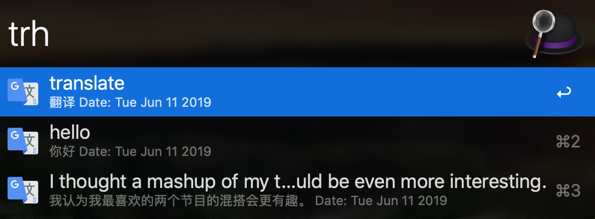

# alfred-translate-history

## Install

*Requires [Node.js](https://nodejs.org) 8+ and the Alfred 3 or 4 [Powerpack](https://www.alfredapp.com/powerpack/).*

- install with `npm install -g alfred-translate-history`
- or [download](https://github.com/xfslove/alfred-translate-history/releases/tag/v1.0.1) workflow

## [Changelog](https://github.com/xfslove/alfred-translate-history/releases)

## Usage

Alfred workflow Keyword `trh`.

without argument, shown your translate history recently.

You can:

- press <kbd>cmd</kbd>+<kbd>C</kbd> to copy the item.
- press <kbd>cmd</kbd>+<kbd>L</kbd> to see the full content.

## Snapshot

